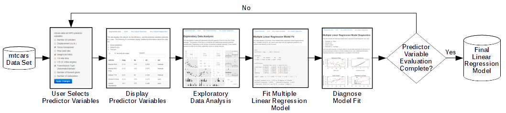
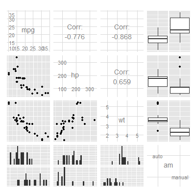

# Multiple Linear Regression Model Example
datasciencespm  
09/20/2014

---
## Shiny Application Overview



- Need: Simplify predictor variable selection process 
- Approach: Implement [Shiny application](https://datasciencespm.shinyapps.io/DevelopingDataProducts/) that provides the following functionality:
  * Select & display predictor variables
  * Perform exploratory data analysis
  * Fit & diagnose a multiple linear regression model

---
## Perform Exploratory Data Analysis


```r
library(GGally)
data(mtcars)
mtcars2 <- mtcars
mtcars2$am <- as.factor(mtcars2$am)
levels(mtcars2$am) <- c("auto","manual")
ggpairs(mtcars2[,c(1,4,6,9)])
```

 
- `ggpairs()` pairs plot illustrates the relationships between the response 
(i.e. `mpg`) and predictor variables selected by a user

---
## Fit Multiple Linear Regression Model

```r
modelFit <- lm(mpg ~ hp + wt + am, data=mtcars2)
summary(modelFit)
```

```
## 
## Call:
## lm(formula = mpg ~ hp + wt + am, data = mtcars2)
## 
## Residuals:
##    Min     1Q Median     3Q    Max 
## -3.422 -1.792 -0.379  1.225  5.532 
## 
## Coefficients:
##             Estimate Std. Error t value Pr(>|t|)    
## (Intercept) 34.00288    2.64266   12.87  2.8e-13 ***
## hp          -0.03748    0.00961   -3.90  0.00055 ***
## wt          -2.87858    0.90497   -3.18  0.00357 ** 
## ammanual     2.08371    1.37642    1.51  0.14127    
## ---
## Signif. codes:  0 '***' 0.001 '**' 0.01 '*' 0.05 '.' 0.1 ' ' 1
## 
## Residual standard error: 2.54 on 28 degrees of freedom
## Multiple R-squared:  0.84,	Adjusted R-squared:  0.823 
## F-statistic:   49 on 3 and 28 DF,  p-value: 2.91e-11
```
- `summary(modelFit)` includes the calculation of the [t-score P(>|t|)](http://www.ats.ucla.edu/stat/stata/output/reg_output.htm) for each linear regression model
coefficient
  * Variables whose coefficient t-score is less than 0.05 are significant 
  predictors of a car's fuel efficiency at the 5% level  

---
## Summary
- This presentation described a [Shiny application](https://datasciencespm.shinyapps.io/DevelopingDataProducts/) that provides the following functionality:
  * Select & display predictor variables
  * Perform exploratory data analysis
  * Fit & diagnose a multiple linear regression model
- Technical References:
  * [Vaidyanathan, R. "Slidfy: Interactive Docs with R Markdown"](http://slidify.github.io/)
  * [Raj, J. "Creating Slick HTML Presentations Using reveal.js"](http://www.sitepoint.com/creating-slick-html-presentations-using-reveal-js/)
  * [Shiny by Rstudio Documentation](http://shiny.rstudio.com/)
  * [Fox, J. "Regression Diagnostics"](http://socserv.socsci.mcmaster.ca/jfox/Courses/Brazil-2009/slides-handout.pdf)
  * [Jacoby, W. "Regression III: Advanced Methods"](http://polisci.msu.edu/jacoby/icpsr/regress3/lectures/week3/11.Outliers.pdf)
